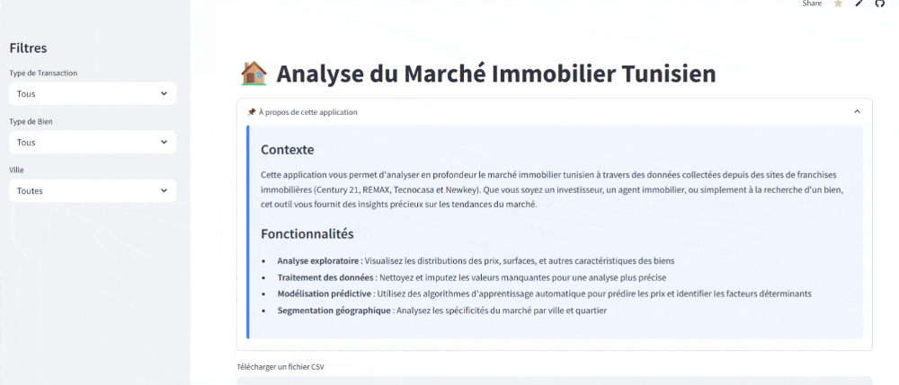
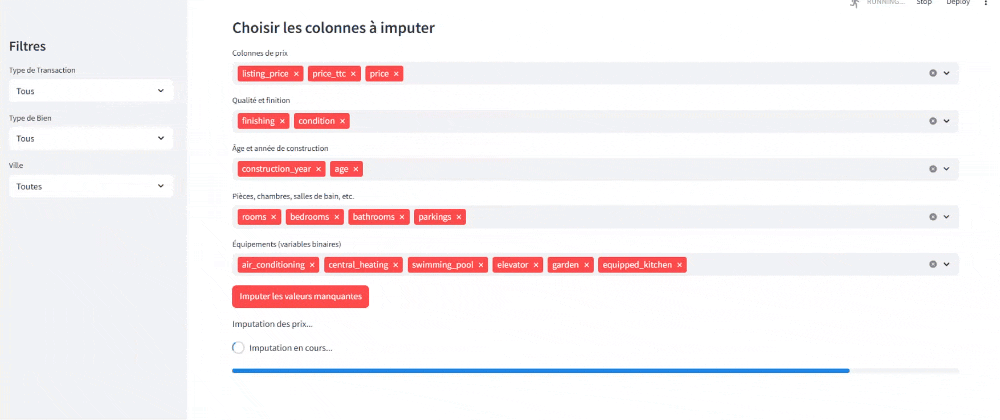
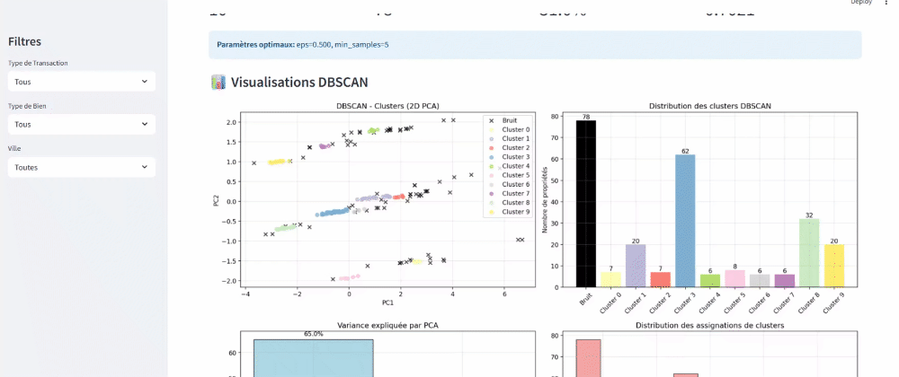
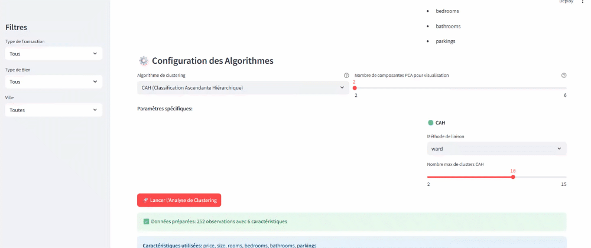
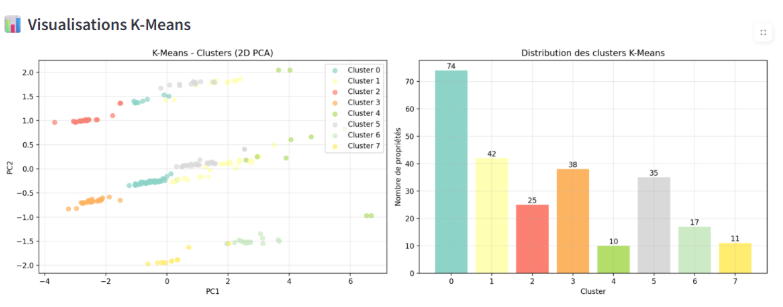
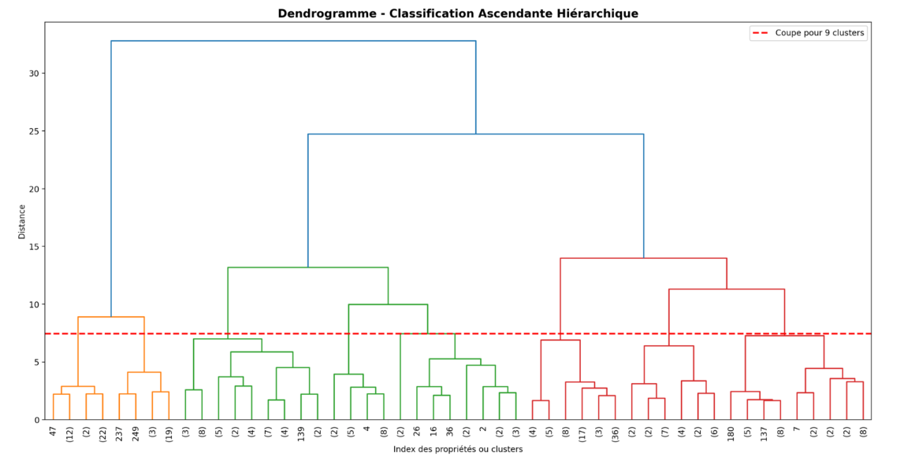
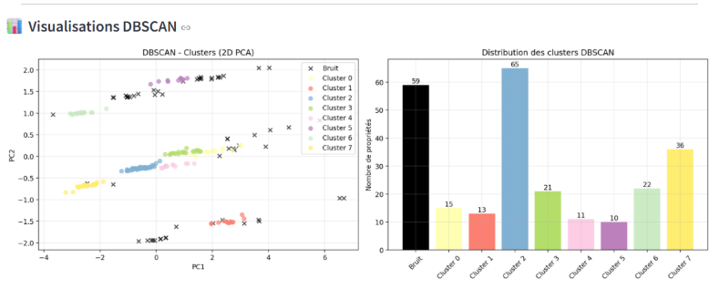

# 🏠 Analyse du Marché Immobilier Tunisien

##  Vue d'ensemble

Ce projet propose une **analyse pertinente et extensible du marché immobilier tunisien** en utilisant des techniques de **Machine Learning supervisé et non supervisé** présentées dans une application Streamlit. L'objectif est de comprendre les tendances du marché , prédire les prix et identifier des segments de propriétés similaires.




Régression linéaire pour la prédiction des prix

Random Forest pour la prédiction de qualité  d'estimation 

XGBoost pour la prédiction de qualité  d'estimation 

Kmeans pour le clustering

DBSCAN pour le clustering

CAH pour la classification ascendante hierarchique


##  Objectifs

- **Exploration** et nettoyage d'un dataset immobilier réel
- **Prédiction des prix** avec la régression linéaire
- **Classification** des biens selon leur estimation de prix
- **Segmentation** du marché avec clustering non supervisé
- **Interface interactive** pour visualiser les résultats

## 📊 Dataset

**Source** : Annonces immobilières provenant de réseaux de franchises (7,431 propriétés)  
**Période** : 2023-2025  
**Colonnes principales** :
- `price` : Prix de vente/location (TND)
- `size` : Superficie (m²)
- `neighborhood` :quartier
- `city` : Ville
- `property_type` : Type de bien (appartement, villa,bureau,duplex etc.)
- `transaction` : Type (vente, location, location meublée)
- `amenities` : Équipements (climatisation, ascenseur, jardin etc.)

```
📁 Structure des données
├── 27 colonnes
├── 7,431 observations
├── Variables numériques : prix, superficie, âge, pièces
├── Variables catégorielles : ville, type, état, finition
└── Variables binaires : équipements immobiliers
```

## 🛠️ Technologies Utilisées

```python
# Manipulation des données
import pandas as pd
import numpy as np

# Machine Learning
from sklearn.model_selection import train_test_split
from sklearn.preprocessing import StandardScaler
from sklearn.linear_model import LinearRegression
from sklearn.ensemble import RandomForestRegressor
from sklearn.cluster import KMeans, DBSCAN
from sklearn.decomposition import PCA
from scipy.cluster.hierarchy import linkage, dendrogram

# Visualisation
import matplotlib.pyplot as plt
import seaborn as sns
import plotly.express as px

# Interface web
import streamlit as st
```


## 📈 Workflow du Projet

### 1. 📥 **Collecte des Données**
```python
# Chargement et aperçu initial
df = pd.read_csv('data.csv')
print(f"Dataset: {df.shape}")
```

### 2. 🧹 **Prétraitement**

#### **Nettoyage des données**
- Conversion des types (numériques, catégorielles)
- Gestion des valeurs manquantes (imputation intelligente)
- Détection et traitement des outliers
- Standardisation des formats

#### **Imputation des valeurs manquantes**
```python
# Stratégie par niveaux
1. Prix → Moyenne par quartier/type/transaction
2. État/Finition → Mode par zone et gamme de prix  
3. Âge/Année → Médiane par groupe similaire
4. Équipements → Mode par type de bien et ville
5. Pièces → Ratio superficie/type de propriété
```

#### **Encodage des variables**
```python
# Variables ordinales
condition: ['à rénover', 'à rafraichir', 'bonne', 'excellente', 'neuf'] → [0,1,2,3,4]
finishing: ['social', 'économique', 'moyen', 'haut', 'très haut'] → [0,1,2,3,4]

# Variables nominales → One-hot encoding
transaction, property_type, neighborhood

# Variables binaires → 0/1
air_conditioning, elevator, swimming_pool, etc.
```

### 3. 🤖 **Apprentissage Supervisé**

#### **A. Régression - Prédiction des Prix**
```python
# Modèle testé
├── Régression Linéaire

# Métriques d'évaluation
├── R² Score
├── RMSE 
├── MAE
```

**Résultats typiques** :
- **R² = 0.85-0.90** selon le segment
- **RMSE ≈ 50,000 TND** sur test set
- Variables importantes : `size`, `age`, `bedrooms`, `condition`

#### **B. Classification - Estimation de Prix**
```python
# Création de catégories
Bien estimé (0) : Ratio prix/marché entre 0.8 et 1.2
Mal estimé (1) : Ratio < 0.8 ou > 1.2

# Modèles
├── Random Forest Classification
├── XGBoost Classification  
└── Accuracy ≈ 75-80%
```

### 4. 🎯 **Apprentissage Non Supervisé**

#### **A. Réduction de Dimensionnalité - PCA**
```python
# Analyse en Composantes Principales
├── PC1 (40% variance) → Axe Standing/Qualité
├── PC2 (25% variance) → Axe Temporel/Configuration
└── Variance totale expliquée ≈ 80%
```

#### **B. Clustering - Segmentation du Marché**

**K-Means Clustering**
```python
# Optimisation automatique (Silhouette Score)
├── Nombre optimal : 3-4 clusters
├── Cluster 1 : Économique (petites surfaces, équipements de base)
├── Cluster 2 : Moyen (taille standard, bon rapport qualité-prix)
├── Cluster 3 : Haut de gamme (grandes surfaces, équipements premium)
└── Cluster 4 : Luxe (propriétés exceptionnelles)
```

Clusters Kmeans des appartements à vendre à La Soukra, Tunis

**Classification Ascendante Hiérarchique (CAH)**
```python
# Dendrogramme pour visualiser la hiérarchie
├── Méthode : Ward
├── Distance : Euclidienne
└── Validation : Silhouette Score + Calinski-Harabasz
```
**Visualisation du dendrogramne**




**DBSCAN**
```python
# Détection automatique de clusters et outliers
├── Avantage : Détecte les formes complexes
├── Identification des propriétés atypiques
└── Pas besoin de spécifier le nombre de clusters
```


Clusters DBSCAN des appartements à vendre à La Soukra, Tunis

## 📊 Métriques et Évaluation

### **Régression**
- **R²** : Coefficient de détermination (≥ 0.8 excellent)
- **RMSE** : Erreur quadratique moyenne  
- **MAE** : Erreur absolue moyenne
- **Cross-validation** : Validation croisée 5-fold

### **Classification**
- **Accuracy** : Précision globale
- **Precision/Recall** : Par classe
- **F1-Score** : Harmonique précision/rappel
- **Matrice de confusion** : Analyse détaillée

### **Clustering**
- **Silhouette Score** : Qualité des clusters (≥ 0.5 bon)
- **Calinski-Harabasz** : Ratio variance inter/intra
- **Inertie** : Homogénéité intra-cluster

## 🚀 Évolutions Futures

### **V2.0 - Améliorations Prévues**
- [ ] **Time Series** : Analyse temporelle des prix
- [ ] **Géolocalisation** : Intégration coordonnées GPS
- [ ] **Images** : Analysis de photos des biens
- [ ] **API REST** : Service de prédiction en ligne
- [ ] **Dashboard Business** : Tableaux de bord exécutifs

### **Optimisations Techniques**
- [ ] **Pipeline MLOps** : Automatisation train/deploy
- [ ] **Feature Engineering** : Variables dérivées avancées  
- [ ] **Hyperparameter Tuning** : Optimisation automatique
- [ ] **Real-time Prediction** : Prédiction en temps réel

